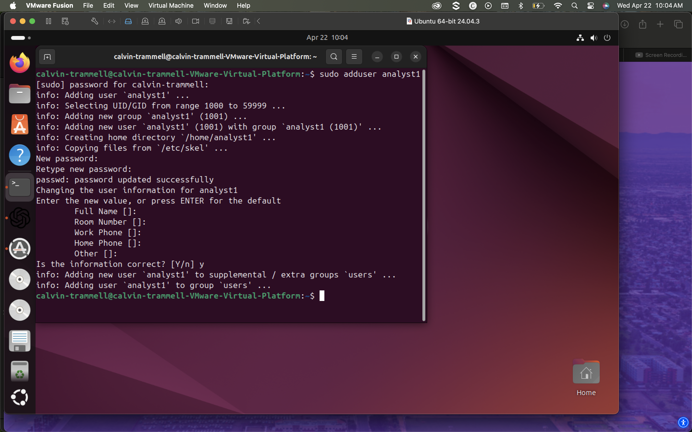
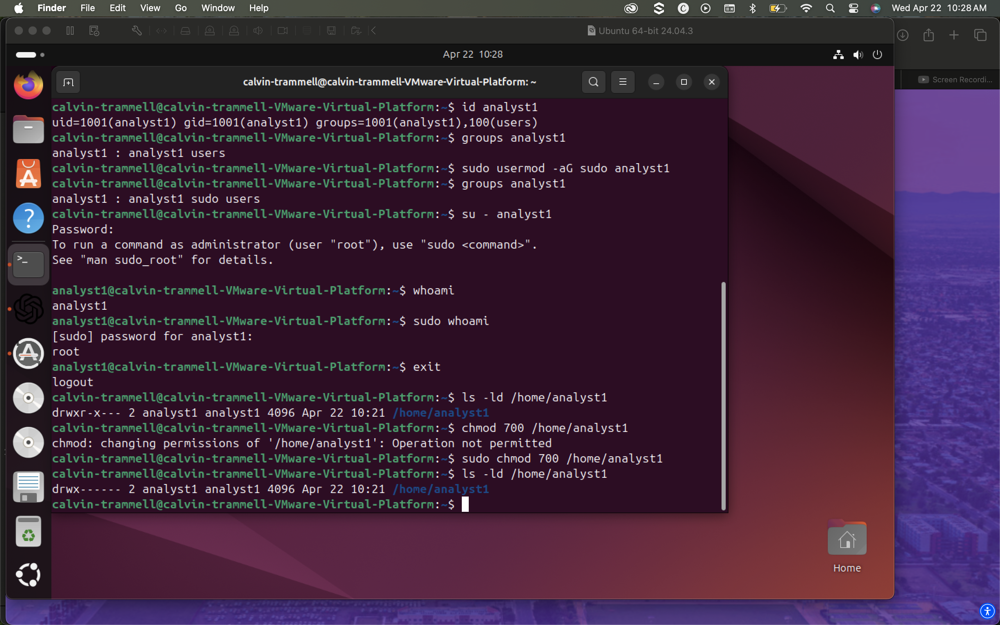
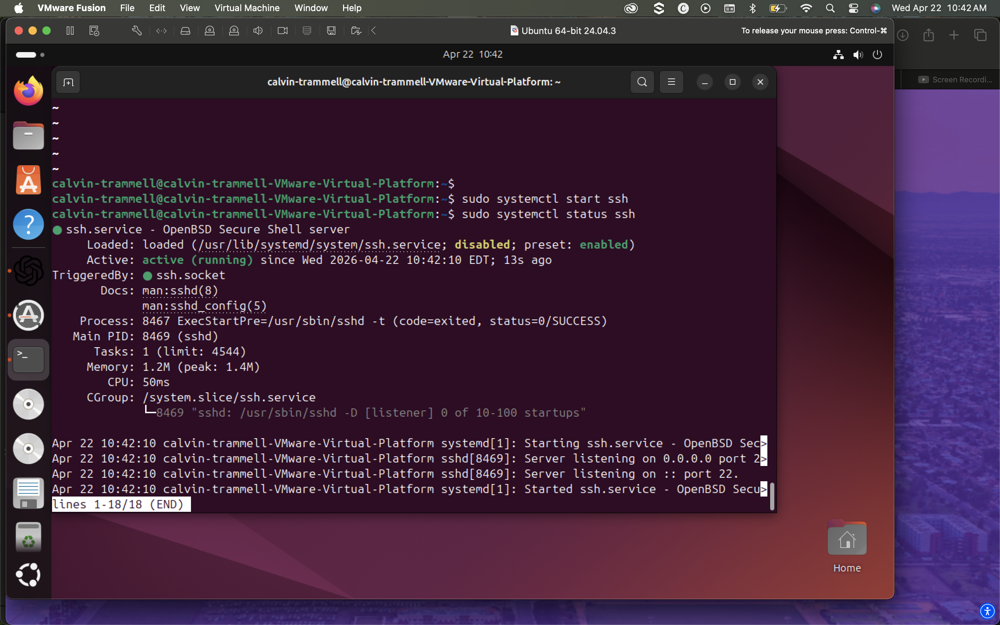
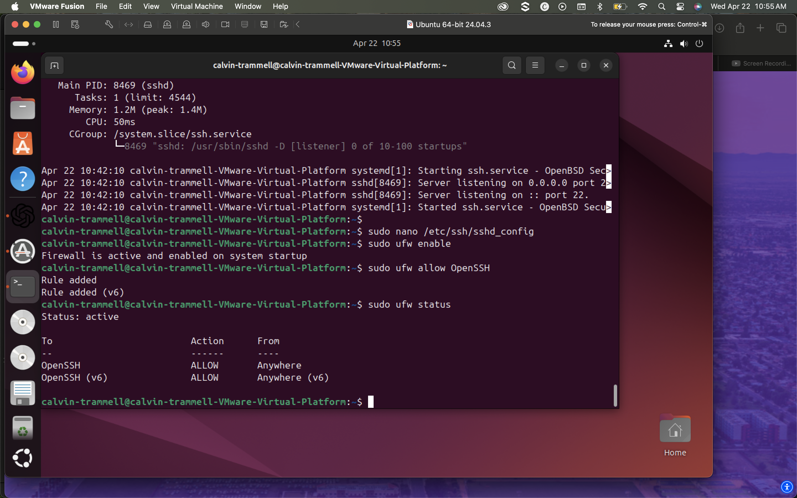
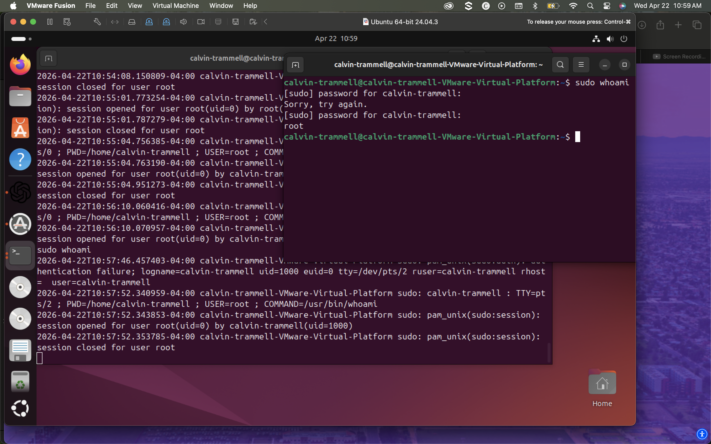
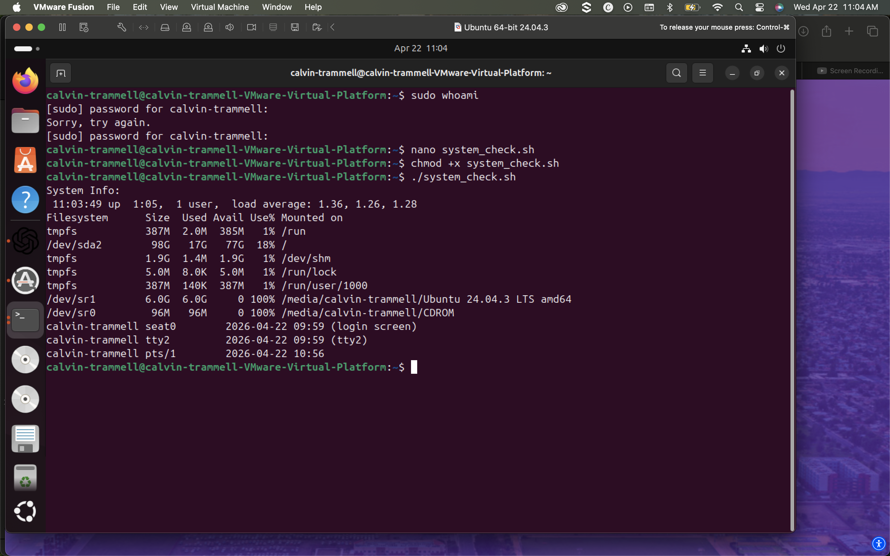

# Linux Secure Server Lab

## 🚀 Project Overview

This project demonstrates hands-on experience with Linux system administration and basic security practices. It simulates real-world tasks such as user management, permission hardening, service troubleshooting, firewall configuration, log monitoring, and automation.

The goal of this project was to build practical, job-ready skills aligned with entry-level IT support, system administration, and cybersecurity roles.

---

## 🔥 Key Highlights

* Created and managed Linux users and groups
* Implemented permission hardening using chmod and chown
* Installed and troubleshot SSH service using systemctl
* Configured firewall rules using UFW
* Monitored authentication logs in real time
* Built a Bash script to automate system checks

---

## 🛠️ Technologies Used

* Ubuntu Linux
* OpenSSH Server
* UFW Firewall
* Bash

---

## 📸 Project Walkthrough

### 👤 User Management & Privileges

Created a new user and assigned administrative privileges using the sudo group.

---

### 🔐 Permission Hardening

Secured the user’s home directory using strict permissions to prevent unauthorized access.

---

### 🔧 Service Management (SSH)

Installed and started the SSH service after identifying it was not running.

---

### 🌐 Firewall Configuration

Enabled the firewall and allowed SSH traffic to ensure secure remote access.

---

### 📊 Log Monitoring

Monitored authentication logs to observe system activity and detect login events.

---

### ⚙️ Automation with Bash

Developed a script to automate system checks such as uptime, disk usage, and logged-in users.

---

## 🧠 What I Learned

* How Linux enforces access control through permissions and ownership
* How to troubleshoot services using systemctl
* The importance of firewall configuration in system security
* How to monitor authentication logs for system activity
* How automation improves efficiency in system administration

---

## 🎯 Real-World Application

This project reflects real responsibilities in:

* IT Help Desk roles
* Junior Linux/System Administrator positions
* Security Operations Center (SOC) environments

It demonstrates the ability to manage, secure, and monitor a Linux system in a practical setting.

---

## 🚀 Next Steps

* Implement SSH key-based authentication
* Disable password authentication for stronger security
* Schedule automated tasks using cron
* Expand scripting for advanced monitoring

---
